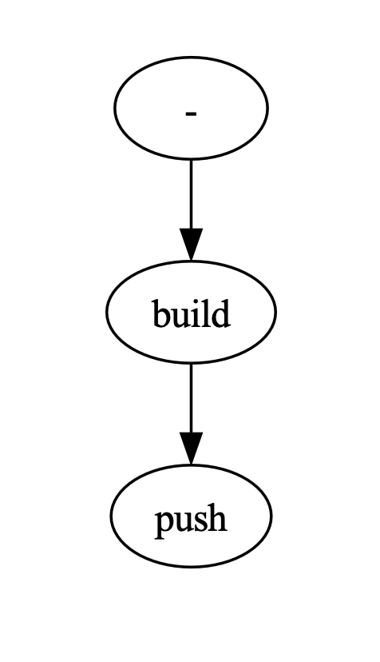

# Google Cloud Build Visualizer

A powerful tool to visualize Google Cloud Build steps in a graph format, enhancing your understanding of build processes and dependencies.

## Table of Contents

- [Overview](#overview)
- [Features](#features)
- [Installation](#installation)
- [Usage](#usage)
- [Example](#example)
- [Important Notes](#important-notes)
- [Contributing](#contributing)
- [License](#license)

## Overview

Google Cloud Build Visualizer is a simple yet effective program that transforms your Cloud Build YAML files into visual graph representations. This tool aids developers and DevOps engineers in better understanding and optimizing their build processes by providing a clear, graphical view of build steps and their relationships.

## Features

- Convert Cloud Build YAML files to visual graphs
- Easy-to-use command-line interface
- Customizable output options
- Automatic file opening for immediate visualization

## Installation

To install the Google Cloud Build Visualizer:

1. Clone the repository
2. Navigate to the repository directory
3. Run the following command:

```bash
pip install .
```

## Usage

After installation, you can use the tool via the command line:

```bash
cloudbuild-visualizer --help
```

This will display the following usage information:

```md
usage: Visualize Cloud Build YAML [-h] [-o OUTPUT] [-s] file

positional arguments:
  file                  Cloud Build YAML file

options:
  -h, --help            show this help message and exit
  -o OUTPUT, --output OUTPUT
                        Output file
  -s, --skip-view       Skips automatically opening the output file in the default viewer
```

## Example

To visualize a Cloud Build YAML file:

```bash
cloudbuild_visualizer cloudbuild.yaml
```

This command will generate a graph visualization of your build steps and automatically open it in your default viewer.

## Important Notes

For the visualizer to work correctly, each step in your Cloud Build YAML file must have a unique `id`. For example:

```yaml
steps:
  - id: build
    name: 'gcr.io/cloud-builders/docker'
    args: ['build', '-t', 'gcr.io/$PROJECT_ID/my-image', '.']
  - id: push
    name: 'gcr.io/cloud-builders/docker'
    args: ['push', 'gcr.io/$PROJECT_ID/my-image']
```

## Output Example

Here's a sample of what the visualized output looks like:



## Contributing

Contributions to the Google Cloud Build Visualizer are welcome! Please feel free to submit a Pull Request.

## License

This project is licensed under the MIT License - see the [LICENSE](LICENSE) file for details.
